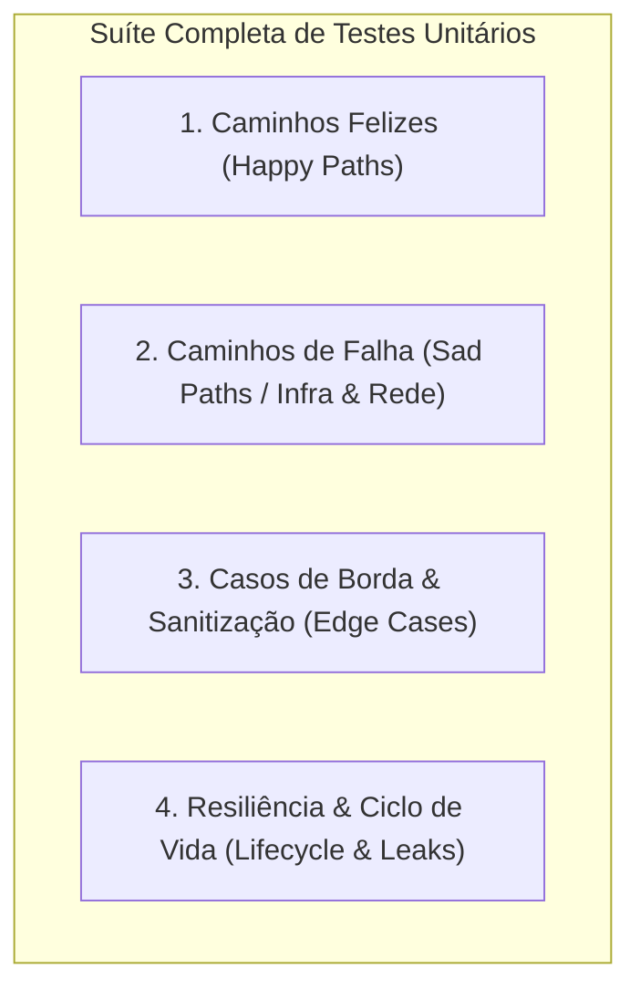
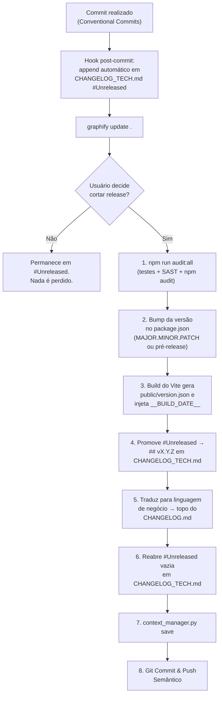
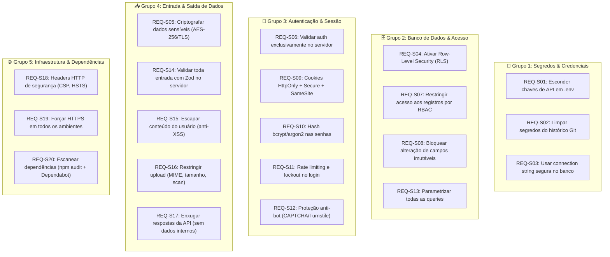
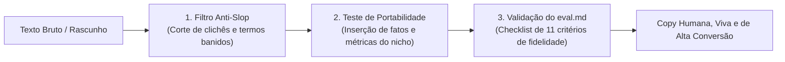

# Guia Definitivo de Replicação: Arquitetura, Automações, Testes, Memória Técnica e Regras de Inteligência

Este documento é o manual canônico para replicar a arquitetura inteira de **Qualidade de Software, Governança de Commits, Versionamento SemVer com Memória Técnica Contínua, Testes Unitários Anti-Regressão, Esteira SDD (Spec-Driven Development), Automação de CI/CD e todas as Regras de Inteligência da IA (Globais e Locais)** em qualquer novo projeto.

Esta é a **versão 2.0** da spec. Ela corrige uma fragilidade estrutural identificada na v1: a perda de contexto técnico sempre que um commit era feito sem incremento de versão (SemVer). A partir desta revisão, **registro de memória técnica e decisão de versionamento são dois processos desacoplados**.

---

## 0. Diagnóstico de Fragilidades Arquiteturais (Auditoria da v1)

Esta seção documenta, sem resumir, cada fragilidade identificada na arquitetura anterior e a razão estrutural do problema. As correções de cada item estão implementadas nas seções seguintes.

### 0.1 Fragilidade Crítica — Conflação entre "Release" e "Registro de Memória"

Na v1, o `CHANGELOG.md` só era escrito no momento do bump de versão (`RULE[commit_and_changelog_policy]`, item 2). Isso significa que **a existência de um registro escrito dependia de uma decisão de negócio** (versionar ou não), quando deveria depender apenas de um fato técnico (uma alteração de código ocorreu). Resultado prático relatado: ao escolher "não versionar" no gate de commit, o trabalho de fix realizado simplesmente não é arquivado em lugar nenhum — nem no Changelog, nem no Knowledge Graph, nem na sessão. A IA perde esse contexto na próxima sessão, porque não há artefato persistente que o capture.

**Causa raiz:** um único arquivo (`CHANGELOG.md`) foi usado para dois públicos e dois propósitos incompatíveis:
- Público externo/negócio → precisa de linguagem amigável, e só faz sentido por versão lançada.
- Público interno/IA → precisa de granularidade por commit, com linguagem técnica, independentemente de haver ou não uma versão associada.

**Correção estrutural (seção 3 e 4):** separação em dois arquivos com ciclos de vida diferentes — `CHANGELOG.md` (releases, negócio) e `docs/CHANGELOG_TECH.md` (memória técnica contínua, todo commit, sempre).

### 0.2 Fragilidade — Governança dependente de memória do agente, não de tooling

Todas as regras de commit, teste antes de commit, e Security Gate eram aplicadas apenas porque a IA "lembrava" de segui-las via prompt (`AGENTS.md`). Não havia enforcement mecânico local (hooks de Git). Isso é frágil porque: (a) qualquer sessão nova, humano operando diretamente, ou falha de raciocínio da IA pode pular a etapa; (b) a única rede de segurança real era a CI, que só age depois do push — tarde demais para localmente barrar um commit malformado.

**Correção estrutural (seção 5 nova):** Husky + commitlint + hooks locais (`pre-commit`, `commit-msg`, `post-commit`) tornam a política executável por máquina, não apenas por instrução textual.

### 0.3 Fragilidade — Ausência de padrão de mensagem de commit

Sem um formato obrigatório de commit (ex.: Conventional Commits), não existe fonte estruturada e legível por máquina do que aconteceu em cada commit. Isso é o que forçava o `CHANGELOG.md` a ser a única fonte de verdade — e por isso sua ausência (quando não há bump) é tão grave. Se o próprio `git log` já fosse estruturado, a perda seria parcial, não total.

**Correção estrutural (seção 2.2 e 5):** adoção obrigatória de Conventional Commits (`feat`, `fix`, `chore`, `refactor`, `test`, `docs`, `security`, `perf`) como padrão de mensagem, validado por `commitlint` no hook `commit-msg`.

### 0.4 Fragilidade — Grafo de conhecimento (graphify) e sessões desacoplados do fluxo de commit

`graphify update .` e `context_manager.py save` dependiam de a IA lembrar de rodá-los "depois de modificar arquivos" — não havia gatilho automático amarrado ao ciclo de vida do commit. Isso cria duas fontes de memória (grafo e sessões) que podem divergir tanto entre si quanto do changelog técnico.

**Correção estrutural (seção 7 revisada):** `graphify update .` passa a ser disparado automaticamente pelo hook `post-commit`; `context_manager.py save` passa a ser disparado no fechamento de cada release (bump de versão) e, opcionalmente, a cada N commits não versionados, para não depender de lembrança humana ou da IA.

### 0.5 Fragilidade — Security Gate contextual sem verificação automatizada mínima

Os 20 requisitos de segurança (seção 9 original) dependiam inteiramente da IA identificar contextualmente quando um gatilho se aplicava. Não havia nenhuma verificação estática automatizada mínima cobrindo os requisitos mais mecânicos (segredos hardcoded, `npm audit`, headers ausentes).

**Correção estrutural (seção 9 revisada):** `audit-esteira.mjs` passa a incluir checagens automatizadas mínimas (regex de padrões de segredo, presença de `helmet`/headers, `npm audit --audit-level=high`) como piso de segurança não dependente de julgamento contextual da IA.

### 0.6 Fragilidade — Falta de rastreabilidade entre Spec/RN e mudanças de código

Não havia exigência de que uma entrada de changelog (técnica ou de negócio) referenciasse a Regra de Negócio (`RN-XXX`) ou seção do `SYSTEM_SPEC.md` que motivou a mudança. Isso quebra a cadeia SDD (Spec-Driven Development) — o próprio objetivo central da arquitetura.

**Correção estrutural (seção 3.1):** campo obrigatório de referência (`Refs:`) em toda entrada de `CHANGELOG_TECH.md`, apontando para `RN-XXX`, `REQ-SXX` ou seção do spec, quando aplicável.

### 0.7 Fragilidade — Ausência de pré-release e de protocolo de rollback

O modelo SemVer original só previa MAJOR/MINOR/PATCH finais. Não havia previsão de tags de pré-lançamento (`-beta.1`, `-rc.1`) para ambientes de staging, nem regra de como tratar reversão de uma versão já publicada (o `CHANGELOG.md` não deve ter entradas apagadas retroativamente).

**Correção estrutural (seção 4.4 nova):** convenção de pré-release e regra de reversão aditiva (nunca destrutiva) do changelog.

### 0.8 Fragilidade — Proteção de branch não explicitada

A CI (`esteira.yml`) valida corretamente pull requests e pushes para `main`, mas a spec original nunca exige que a branch `main` esteja configurada como protegida exigindo esse status check antes do merge. Sem isso, a CI é apenas informativa, não bloqueante.

**Correção estrutural (checklist, item 16 novo):** exigência explícita de branch protection no GitHub apontando para o job `audit` da Esteira como *required status check*.

---

## 1. Visão Geral da Arquitetura (Revisada)

```mermaid
flowchart TD
    subgraph G[" 1. Nível Global (Máquina / Antigravity)"]
        G1["Idioma Estrito: Português do Brasil"]
        G2["Manutenção e Reinício de Serviços"]
        G3["Filosofia de UI/UX Intuitiva"]
        G4["Design SaaS Premium & Paleta Dedicada"]
        G5["Landing Page Persuasiva & Copywriting Humano"]
        G6["Painel Super Usuário (Admin) Obrigatório"]
    end

    subgraph L[" 2. Nível Local (Repositório / .agents/)"]
        L1["Trava Estrita de Commit/Push Automático"]
        L2["Conventional Commits Obrigatório"]
        L3["Pergunta Obrigatória sobre Corte de Release (SemVer)"]
        L4["Security Gate SAST Automatizado + Contextual"]
        L5["TDD & Testes Unitários Obrigatórios (Anti-Regressão)"]
        L6["Copywriting Humano & Proteção Anti-AI Slop"]
        L7["Memória Técnica Contínua (CHANGELOG_TECH.md)"]
    end

    subgraph H[" 3. Camada de Enforcement Mecânico (Git Hooks)"]
        H1["pre-commit: testes + lint + secret scan"]
        H2["commit-msg: commitlint (Conventional Commits)"]
        H3["post-commit: append CHANGELOG_TECH.md + graphify update"]
    end

    subgraph T[" 4. Camada de Testes Unitários (Vitest)"]
        T1["Testes de Regras de Negócio (RNs)"]
        T2["Testes de Schemas / Contratos (Zod)"]
        T3["Testes de Utilitários e Lógica Pura"]
        T4["Execução Contínua (npm test / CI)"]
    end

    subgraph E[" 5. Esteira e CI/CD (scripts/ + GitHub Actions)"]
        E1["audit-esteira.mjs (Gate SDD, SemVer, SAST, Testes, Commitlint)"]
        E2["validate-mermaid.mjs (Diagramas)"]
        E3["eval-spec-fidelity.mjs (Fidelidade Spec→Código)"]
        E4[".github/workflows/esteira.yml (CI Canônica, branch protection)"]
    end

    subgraph V[" 6. Pipeline de Versionamento e Release"]
        V1["CHANGELOG_TECH.md — Unreleased (todo commit)"]
        V2["Decisão de Release (usuário)"]
        V3["Promoção Unreleased → [vX.Y.Z] em ambos changelogs"]
        V4["package.json (SemVer) + version.json + __BUILD_DATE__"]
        V5["CHANGELOG.md (negócio) gerado a partir do técnico"]
        V6["Tela de Ajuda / Changelog Visual"]
    end

    subgraph M[" 7. Memória Persistente (Knowledge Graph + Sessões)"]
        M1["graphify — grafo de código, atualizado por hook"]
        M2["context_manager.py — snapshots de sessão, por release"]
    end

    G --> L
    L --> H
    H --> T
    T --> E
    H -->|todo commit| V1
    V1 --> V2
    V2 -->|sim| V3
    V3 --> V4
    V4 --> V5
    V5 --> V6
    H --> M1
    V3 --> M2
```



---

## 2. As 6 Regras Globais de Inteligência (DNA Antigravity)

Sem alterações em relação à v1. Ficam em `C:\Users\<seu-usuario>\.gemini\config\rules\` e são aplicadas automaticamente em todos os projetos abertos.

### 2.1 Idioma de Operação
Todas as respostas, documentações de código, comentários, commits e textos de interface devem ser estritamente em **Português do Brasil (pt-BR)**.

### 2.2 Manutenção e Reinício de Serviços
Sempre que for realizada uma alteração profunda no código ou na arquitetura, a IA deve incluir comandos ou procedimentos para reiniciar todos os serviços necessários (Docker, bancos de dados, servidores de desenvolvimento, instâncias de API) para garantir que a aplicação funcione imediatamente.

### 2.3 Filosofia de UI/UX
Aplicar sempre as melhores técnicas de interface e experiência do usuário. O foco deve ser a satisfação do cliente final, eliminando atritos, redundâncias e garantindo uma curva de aprendizado extremamente simples e intuitiva.

### 2.4 Design SaaS Premium
O sistema deve ter um visual de altíssimo nível. Deve ser realizada uma pesquisa de paleta de cores dedicada ao nicho do negócio, mantendo a consistência visual em todas as funcionalidades, telas e módulos.

### 2.5 Landing Page Persuasiva & Copywriting Humano (Anti-AI Slop)
A página inicial deve ser projetada para conversão, com copywriting convincente, natural e livre de clichês de IA (*No AI Slop*), imagens contextualizadas ao negócio e uma área de autenticação/login integrada e elegante. Todo texto deve focar em problemas e benefícios concretos, evitando adjetivos vazios ou linguagem pasteurizada.

### 2.6 Arquitetura de Gerenciamento (Painel Super Admin)
Todo projeto deve obrigatoriamente contar com um painel de Super Usuário (Admin) para gerenciar os demais usuários, permissões (RBAC), planos e acessos do sistema.

---

## 3. Regras Locais de Governança (`.agents/AGENTS.md`) — Revisadas

Para cada novo projeto, crie o arquivo `.agents/AGENTS.md` na raiz com o seguinte conteúdo obrigatório:

```markdown
# Regras de Governança de Commit, Memória Técnica, Versionamento e Changelog

<RULE[commit_and_changelog_policy]>
1. **NUNCA EXECUTAR COMMIT OU PUSH AUTOMATICAMENTE**:
   - É estritamente proibido realizar git commit ou git push por iniciativa própria ou atos de proatividade.
   - O commit e push somente devem ser executados quando o USUÁRIO pedir ou der o comando explícito (ex: "faça o commit", "pode commitar").

2. **CONVENTIONAL COMMITS OBRIGATÓRIO**:
   - Toda mensagem de commit DEVE seguir o padrão Conventional Commits: `<tipo>(<escopo opcional>): <descrição curta>`.
   - Tipos permitidos: `feat`, `fix`, `refactor`, `perf`, `test`, `docs`, `chore`, `security`, `ci`.
   - O hook `commit-msg` (commitlint) bloqueia qualquer commit fora do padrão. Ver Seção 5.

3. **MEMÓRIA TÉCNICA É INDEPENDENTE DE VERSIONAMENTO**:
   - Todo commit, COM OU SEM bump de versão, gera obrigatoriamente uma entrada em `docs/CHANGELOG_TECH.md`, na seção `## [Unreleased]`.
   - Essa entrada é gerada automaticamente pelo hook `post-commit` (Seção 5) a partir da mensagem de commit, arquivos alterados e, se aplicável, referência a `RN-XXX` / `REQ-SXX` / seção do `SYSTEM_SPEC.md`.
   - Esta etapa NUNCA é opcional e NUNCA depende de decisão do usuário. A decisão do usuário afeta apenas o corte de release (item 4), nunca o registro do que foi feito.

4. **PERGUNTA OBRIGATÓRIA SOBRE CORTE DE RELEASE (NÃO SOBRE REGISTRO)**:
   - Sempre que o usuário solicitar um commit, a IA deve perguntar se aquele commit também deve **cortar uma release** (promover o conteúdo de `## [Unreleased]` para uma nova versão SemVer + `CHANGELOG.md` de negócio) ou se deve permanecer acumulando em `## [Unreleased]` para uma release futura.
   - Se o usuário optar por não cortar release, a entrada técnica already gerada no item 3 permanece em `## [Unreleased]` — nada é perdido, apenas o lançamento formal é adiado.

5. **FLUXO DE LANÇAMENTO (CORTE DE RELEASE), AUDITORIA DE SEGURANÇA E ATUALIZAÇÃO DO CHANGELOG**:
   - Toda alteração de versão (bump version) se dá exclusivamente no momento em que o usuário decide cortar uma release.
   - **AUDITORIA DE SEGURANÇA OBRIGATÓRIA (SECURITY GATE)**:
     - Antes de qualquer commit e push, é obrigatório executar a suíte completa de testes e a auditoria estática (`npm run audit:all` ou `node scripts/audit-esteira.mjs .`).
     - A análise deve verificar:
       a) Suíte completa de testes unitários passando 100% sem erros (`npm test`).
       b) Regras de acesso e autorização (Firestore/SQL Security Rules, RBAC, controle de papéis).
       c) Exposição de segredos, tokens ou chaves de API (checagem automatizada por regex + `git-secrets`).
       d) Validação de dados de entrada, injeções e vetores de escalada de privilégios.
       e) Imutabilidade de logs de auditoria e consistência de integridade.
       f) `npm audit --audit-level=high` sem vulnerabilidades pendentes.
     - Se houver qualquer vulnerabilidade ou teste quebrado, o problema DEVE ser corrigido e validado antes de prosseguir com o commit.
   - Ao cortar uma release:
     a) Realizar e aprovar a suíte de testes unitários e a Auditoria de Segurança obrigatória.
     b) Incrementar a versão no `package.json` seguindo SemVer (MAJOR, MINOR, PATCH ou pré-release — ver Seção 4.4).
     c) Promover todo o conteúdo de `docs/CHANGELOG_TECH.md` (`## [Unreleased]`) para uma nova seção `## [vX.Y.Z] - AAAA-MM-DD` no mesmo arquivo, preservando a granularidade técnica.
     d) Traduzir esse conteúdo técnico para linguagem amigável de negócio e escrever o topo do `CHANGELOG.md` com a nova versão, a data do dia e a descrição dos recursos.
     e) Reabrir uma seção `## [Unreleased]` vazia em `docs/CHANGELOG_TECH.md` para os próximos commits.
     f) Somente após os passos acima e da aprovação de segurança/testes, executar o `git commit` e `git push`.
     g) Disparar `python context_manager.py save` para gerar o snapshot de sessão vinculado à release.
</RULE[commit_and_changelog_policy]>

<RULE[technical_memory_policy]>
1. **`docs/CHANGELOG_TECH.md` É FONTE DE VERDADE TÉCNICA, NÃO NEGOCIÁVEL**:
   - Este arquivo é a memória técnica primária do projeto e existe independentemente de haver releases.
   - Nenhum commit é considerado completo sem uma entrada correspondente em `## [Unreleased]`.
2. **FORMATO OBRIGATÓRIO DA ENTRADA**:
   ```
   - [<tipo>] <descrição técnica objetiva> (commit: <hash curto>) — Refs: <RN-XXX | REQ-SXX | spec §N | nenhuma>
   ```
3. **PROIBIDO REESCREVER OU APAGAR HISTÓRICO**:
   - Entradas já promovidas para uma versão (`## [vX.Y.Z]`) nunca são editadas ou removidas retroativamente.
   - Correções sobre releases anteriores geram nova entrada (`fix`) referenciando a versão corrigida, nunca alteram o passado.
</RULE[technical_memory_policy]>
```

---

# Regras de Testes Unitários & Proteção Anti-Regressão (TDD Gate)

```markdown
<RULE[unit_testing_and_anti_regression_policy]>
1. **TESTES UNITÁRIOS OBRIGATÓRIOS A CADA NOVA IMPLEMENTAÇÃO**:
   - Toda nova funcionalidade, novo hook, novo utilitário, novo endpoint/schema ou correção de bug DEVE obrigatoriamente vir acompanhada de testes unitários automatizados (`*.test.ts` / `*.spec.ts`).
   - Os testes devem cobrir tanto o fluxo principal (caminho feliz) quanto casos de borda (*edge cases*, valores nulos, strings vazias, falhas de rede, limites numéricos).

2. **PROTEÇÃO ANTI-REGRESSÃO ESTREITA**:
   - NUNCA submeter alterações no código-fonte sem antes rodar a suíte completa de testes com `npm test`. O hook `pre-commit` (Seção 5) enforça isso mecanicamente.
   - Se uma nova alteração quebrar qualquer teste unitário pré-existente, a alteração é considerada INVÁLIDA até que a regressão seja corrigida ou o teste seja adaptado justificadamente.
   - A esteira de CI/CD (`.github/workflows/esteira.yml`) bloqueia automaticamente o merge se houver 1 teste unitário falhando, e a branch `main` deve estar configurada para exigir esse status check (Seção 8, item 16).
</RULE[unit_testing_and_anti_regression_policy]>
```

# Regras de Copywriting Humano & Proteção Anti-AI Slop

```markdown
<RULE[human_copywriting_and_anti_slop_policy]>
1. **PROIBIDO USO DE CLICHÊS E VÍCIOS DE ESCRITA DE IA (ANTI-AI SLOP)**:
   - Em Landing Pages, modais, banners, Onboarding, `CHANGELOG.md` (negócio), documentações de regras de negócio (`docs/REGRAS_DE_NEGOCIO.md`) e microcopy de UI, a IA NUNCA deve usar escrita robótica, empolgação falsa ou clichês corporativos vazios.
   - **Termos banidos**: "robusto", "ecossistema inovador", "revolucionário", "divisor de águas", "virada de chave", "fomentar", "desvendar", "mergulhar fundo", "empoderar", "alavancar", "leverage", "delve", "streamline", "cutting-edge".
   - **Estruturas banidas**: contrastes binários falsos, preâmbulos vazios, falsos insights, revelações com dois pontos, frases dramáticas fragmentadas, finais falso-profundos, ciclismo de sinônimos para a mesma funcionalidade técnica.
   - **Exceção explícita**: `docs/CHANGELOG_TECH.md` é um artefato técnico interno, não literário. Suas entradas devem ser objetivas e telegráficas (ver formato na Seção 3, `RULE[technical_memory_policy]`) e NÃO estão sujeitas ao filtro anti-slop — precisão técnica tem prioridade sobre estilo ali.

2. **VOZ ATIVA, CONCREÇÃO E TESTE DE PORTABILIDADE**:
   - Todo texto de negócio deve passar no **Teste de Portabilidade**: se a frase puder ser movida inalterada para qualquer outro software ou concorrente, ela é genérica e deve ser substituída por dados, números, prazos e consequências reais do negócio.
   - Sempre priorizar **voz ativa**, números quantitativos, nomes exatos de botões e instruções claras que demonstram o valor prático em vez de bajular o leitor.
</RULE[human_copywriting_and_anti_slop_policy]>
```

---

## 4. Camada de Testes Unitários & Proteção Anti-Regressão (Vitest)

Sem alterações estruturais em relação à v1.

### 4.1 Escolha da Tecnologia: Vitest
- Execução ultra-rápida nativa com multithreading.
- Suporte nativo a ESM, TypeScript e JSX/TSX sem transpiladores pesados.
- Integração transparente com Vite (`vite.config.ts`).
- Compatibilidade total com APIs do Jest (`describe`, `it`, `expect`, `vi.fn()`).

### 4.2 Como Organizar os Arquivos de Teste
Mantenha os arquivos de teste lado a lado com os arquivos testados ou em pastas `__tests__`:
- `src/utils/calc.ts` → `src/utils/calc.test.ts`
- `src/services/regrasNegocio.ts` → `src/services/regrasNegocio.test.ts`
- `src/schemas/meuSchema.ts` → `src/schemas/meuSchema.test.ts`

### 4.3 Scripts nos `package.json`
```json
"scripts": {
  "test": "vitest run",
  "test:watch": "vitest",
  "test:coverage": "vitest run --coverage",
  "prepare": "husky"
}
```

### 4.4 Matriz Canônica de Cenários de Teste (Happy Paths, Sad Paths & Edge Cases)

Para garantir resiliência real em produção, **toda suíte de testes deve obrigatoriamente cobrir 4 categorias de cenários**:



| Categoria | O que testar | Exemplo de Asserção |
| :--- | :--- | :--- |
| **1. Caminho Feliz (*Happy Path*)** | Criação, edição, exclusão e leitura com dados válidos e resposta de sucesso. | `expect(id).toBeDefined()`, `expect(setDoc).toHaveBeenCalledTimes(1)` |
| **2. Caminho de Falha (*Sad Path*)** | Falhas de conexão, Firestore/banco inacessível, rejeição de transação (`batch.commit`). | `setDoc.mockRejectedValueOnce(error)` $\rightarrow$ lança exceção e **não grava log falso de auditoria**. |
| **3. Casos de Borda (*Edge Cases*)** | Nulos (`null`, `undefined`, `""`), payloads gigantes (10k chars), emojis, tags HTML/script (`<script>`), IDs inexistentes e arrays vazios. | `normalizeText('<script>')` sanitizado, `deleteMultiple([])` não dispara batch. |
| **4. Resiliência & Ciclo de Vida** | Múltiplas interações simultâneas, timers assíncronos (`useFakeTimers`), desmontagem rápida de hooks sem *memory leak*. | `unmount()` remove todos os `eventListener` de `window`. |

#### Exemplo Canônico de Teste de Sad Path (Falha de Rede & Integridade de Auditoria):
```typescript
it('deve propagar erro e NÃO registrar log de auditoria se a persistência no banco falhar', async () => {
  const dbError = new Error('Falha de conexão com Firestore');
  (setDoc as Mock).mockRejectedValueOnce(dbError);

  await expect(systemsService.addSystem('admin@goias.gov.br', payload))
    .rejects.toThrow('Falha de conexão com Firestore');

  // Garante que não foi gerado log fantasma de sucesso
  expect(auditService.logAction).not.toHaveBeenCalled();
});
```

---

## 5. Camada de Enforcement Mecânico — Git Hooks (Nova)

Esta camada resolve as Fragilidades 0.2, 0.3 e 0.4: as regras deixam de depender apenas de instrução textual à IA e passam a ser aplicadas por tooling local, com fallback na CI.

### 5.1 Instalação
```bash
npm install -D husky @commitlint/cli @commitlint/config-conventional
npx husky init
```

### 5.2 `commitlint.config.cjs`
```javascript
module.exports = {
  extends: ['@commitlint/config-conventional'],
  rules: {
    'type-enum': [
      2,
      'always',
      ['feat', 'fix', 'refactor', 'perf', 'test', 'docs', 'chore', 'security', 'ci'],
    ],
  },
};
```

### 5.3 `.husky/pre-commit`
```bash
#!/usr/bin/env sh
npm test || exit 1
node scripts/audit-esteira.mjs . --pre-commit || exit 1
```

### 5.4 `.husky/commit-msg`
```bash
#!/usr/bin/env sh
npx --no -- commitlint --edit "$1"
```

### 5.5 `.husky/post-commit`
```bash
#!/usr/bin/env sh
node scripts/append-tech-changelog.mjs
graphify update . || true
```

O script `scripts/append-tech-changelog.mjs` lê a última mensagem de commit (`git log -1 --pretty=%s`) e o hash curto (`git log -1 --pretty=%h`), classifica o tipo pelo prefixo Conventional Commits, e insere automaticamente uma linha na seção `## [Unreleased]` de `docs/CHANGELOG_TECH.md`, no formato definido em `RULE[technical_memory_policy]`. Isso remove a dependência de a IA "lembrar" de escrever a entrada — o registro passa a ser um efeito colateral mecânico do próprio commit.

---

## 6. O Pipeline de Versionamento SemVer com Memória Técnica Contínua



### 6.1 Critérios SemVer

| Tipo | Exemplo | Quando Usar |
| :--- | :--- | :--- |
| **PATCH** | `1.0.0` → `1.0.1` | Correções de bugs, ajustes de CSS, hotfixes, melhorias internas de script/CI |
| **MINOR** | `1.0.0` → `1.1.0` | Novas funcionalidades, novos módulos, novos filtros/relatórios, recursos retrocompatíveis |
| **MAJOR** | `1.0.0` → `2.0.0` | Refatoração completa de arquitetura, migração de banco, mudança de framework, quebra de compatibilidade |

### 6.2 Componente 1 — `package.json` (Fonte da Verdade da Versão)
```json
{
  "name": "meu-novo-projeto",
  "version": "1.0.0"
}
```

### 6.3 Componente 2 — Plugin de Geração Automática do `public/version.json` (no `vite.config.ts`)
```typescript
import fs from 'fs';
import path from 'path';
import { fileURLToPath } from 'url';
import { defineConfig } from 'vite';

const __filename = fileURLToPath(import.meta.url);
const __dirname = path.dirname(__filename);
const buildTimestamp = Date.now();

function versionGeneratorPlugin() {
  return {
    name: 'version-generator',
    buildStart() {
      let pkgVersion = '1.0.0';
      const rootPkgPath = path.resolve(__dirname, '../../package.json');
      const localPkgPath = path.resolve(__dirname, 'package.json');

      if (fs.existsSync(rootPkgPath)) {
        pkgVersion = JSON.parse(fs.readFileSync(rootPkgPath, 'utf-8')).version || pkgVersion;
      } else if (fs.existsSync(localPkgPath)) {
        pkgVersion = JSON.parse(fs.readFileSync(localPkgPath, 'utf-8')).version || pkgVersion;
      }

      const now = new Date(buildTimestamp);
      const versionData = {
        version: pkgVersion,
        buildTime: buildTimestamp,
        buildDate: now.toLocaleString('pt-BR', { timeZone: 'America/Sao_Paulo' }),
      };

      const publicDir = path.resolve(__dirname, 'public');
      if (!fs.existsSync(publicDir)) fs.mkdirSync(publicDir, { recursive: true });
      fs.writeFileSync(path.resolve(publicDir, 'version.json'), JSON.stringify(versionData, null, 2), 'utf-8');
    },
  };
}

export default defineConfig({
  plugins: [react(), versionGeneratorPlugin()],
  define: {
    __BUILD_DATE__: JSON.stringify(new Date(buildTimestamp).toLocaleString('pt-BR', { timeZone: 'America/Sao_Paulo' })),
    __BUILD_TIME__: buildTimestamp,
  },
});
```

### 6.4 Pré-lançamentos e Protocolo de Reversão (Novo)

**Pré-release:** para ambientes de staging/homologação, usar sufixo SemVer padrão: `1.3.0-rc.1`, `1.3.0-beta.2`. O `version.json` e o `CHANGELOG_TECH.md` seguem o mesmo fluxo de promoção, mas a entrada em `CHANGELOG.md` (negócio) só é escrita na versão final estável, não em cada pré-release.

**Reversão de release:** nunca apagar ou editar uma entrada já publicada em `CHANGELOG.md` ou `CHANGELOG_TECH.md`. Uma reversão gera uma nova versão PATCH com uma entrada explícita do tipo `fix` ou `revert`, referenciando a versão revertida (ex.: `- [revert] Reverte alterações de pagamento introduzidas em v1.4.0 — Refs: v1.4.0`).

---

## 7. Estrutura dos Arquivos de Changelog (Novo — Núcleo da Correção)

### 7.1 `docs/CHANGELOG_TECH.md` — Memória Técnica Contínua

Formato baseado em Keep a Changelog, com granularidade por commit em vez de por release:

```markdown
# Changelog Técnico

Todas as alterações técnicas relevantes deste projeto são documentadas aqui, no momento em que ocorrem — antes e independentemente de qualquer decisão de release.

## [Unreleased]
- [fix] Corrige cálculo de frete para CEPs com 9 dígitos (commit: a1b2c3d) — Refs: RN-014
- [test] Adiciona cobertura de edge case para carrinho vazio (commit: e4f5g6h) — Refs: nenhuma
- [chore] Atualiza dependência zod para 3.23.8 (commit: i7j8k9l) — Refs: REQ-S20

## [1.2.0] - 2026-07-14
- [feat] Implementa filtro de relatórios por período customizado (commit: m1n2o3p) — Refs: RN-009
- [security] Adiciona rate limiting no endpoint de login (commit: q4r5s6t) — Refs: REQ-S11
```

### 7.2 `CHANGELOG.md` — Release Log de Negócio (formato mantido da v1, agora derivado do técnico)

```markdown
# Changelog

## [1.2.0] - 2026-07-14
### Adicionado
- Agora é possível filtrar relatórios por qualquer intervalo de datas, não apenas mês corrente.

### Segurança
- O login passa a bloquear tentativas repetidas, reduzindo o risco de acesso indevido.
```

A tradução do técnico para o de negócio é feita pela IA no momento do corte de release (Seção 3, `RULE[commit_and_changelog_policy]`, item 5-d), aplicando as regras de `RULE[human_copywriting_and_anti_slop_policy]`.

---

## 8. Scripts da Esteira de Qualidade (`scripts/`) — Atualizados

| Script | O que valida |
| :--- | :--- |
| **`audit-esteira.mjs`** | Paridade de versão `package.json` ↔ `CHANGELOG.md`, sequência de RNs no `docs/REGRAS_DE_NEGOCIO.md`, detecção de suítes de testes unitários, Security Gate SAST contra segredos, `npm audit --audit-level=high`, e (novo) verificação de que `docs/CHANGELOG_TECH.md` possui `## [Unreleased]` não vazia antes de qualquer corte de release |
| **`append-tech-changelog.mjs`** *(novo)* | Disparado pelo hook `post-commit`; extrai tipo/hash/descrição do commit e insere a linha correspondente em `## [Unreleased]` de `docs/CHANGELOG_TECH.md` |
| **`validate-mermaid.mjs`** | Sintaxe e delimitadores dos blocos ` ```mermaid ` em todos os `.md` do projeto |
| **`eval-spec-fidelity.mjs`** | Cobertura de implementação de especificações em `SYSTEM_SPEC.md` / `docs/`, incluindo checagem cruzada com `Refs:` do `CHANGELOG_TECH.md` |

---

## 9. Configuração Canônica de CI/CD (`.github/workflows/esteira.yml`) — Atualizada

```yaml
name: Esteira

on:
  pull_request:
    branches: [main]
  push:
    branches: [main]
  workflow_dispatch:

jobs:
  audit:
    name: Auditoria da esteira
    runs-on: ubuntu-latest
    permissions:
      contents: read
    steps:
      - name: Checkout do repositório
        uses: actions/checkout@v4
        with:
          fetch-depth: 0

      - name: Configurar Node.js
        uses: actions/setup-node@v4
        with:
          node-version: 22

      - name: Instalar dependências
        run: npm ci

      - name: Validar mensagens de commit (Conventional Commits)
        run: npx commitlint --from=origin/main --to=HEAD

      - name: Executar testes unitários (Vitest)
        run: npm test

      - name: Auditoria de dependências
        run: npm audit --audit-level=high

      - name: Validar estrutura da esteira
        run: node scripts/audit-esteira.mjs .

      - name: Validar diagramas Mermaid
        run: node scripts/validate-mermaid.mjs .

      - name: Eval de fidelidade spec→implementação
        run: node scripts/eval-spec-fidelity.mjs .
```

---

## 10. Knowledge Graph & Memória de Sessão Anti-Amnésia — Revisado

### 10.1 Graphify (`.agents/rules/graphify.md`)
```markdown
## graphify
This project has a graphify knowledge graph at graphify-out/.
Rules:
- For codebase or architecture questions, when graph.json exists, first run graphify query "<question>".
- Use graphify path "<A>" "<B>" for relationships and graphify explain "<concept>" for focused concepts.
- graphify update . is triggered automatically by the post-commit hook. Do not rely on manual invocation as the primary mechanism; only run it manually to force a refresh mid-session before a query.
```

### 10.2 Context Manager (`context_manager.py`)
- `python context_manager.py init` — Inicializa o armazenamento de sessões.
- `python context_manager.py save` — Gera o resumo da sessão atual em `docs/sessions/session-NNN.md`. Disparado automaticamente ao final de todo corte de release (Seção 3, item 5-g); pode também ser chamado manualmente ao final de qualquer sessão de trabalho relevante, mesmo sem release.
- `python context_manager.py load` — Carrega o histórico da última sessão salva.
- `python context_manager.py search "<termo>"` — Pesquisa decisões técnicas passadas.
- `python context_manager.py status` — Exibe status geral do contexto.

**Nota de integração:** `docs/CHANGELOG_TECH.md` é a fonte primária de granularidade por commit; `context_manager.py` é a fonte de granularidade por sessão de trabalho; `graphify` é a fonte de relações estruturais entre entidades de código. As três camadas são complementares, não redundantes — nenhuma substitui a outra, e nenhuma delas mais depende exclusivamente de lembrança da IA para ser alimentada.

---

## 11. Checklist de Inicialização — Novos Projetos em 18 Passos (Atualizado)

### 🏗️ Fundação
1. Criar `.agents/AGENTS.md` com as regras de commit, memória técnica (`RULE[technical_memory_policy]`), versionamento, testes unitários, Copywriting Humano Anti-AI Slop e Security Gate dos 20 Requisitos.
2. Criar `.agents/rules/graphify.md` com as regras de consulta ao grafo.
3. Criar `docs/CHANGELOG_TECH.md` com a seção `## [Unreleased]` vazia desde o primeiro commit.

### 🔒 Segurança — Configurar antes do primeiro endpoint
4. Criar `.env.example` e garantir que `.env`, `.env.local`, `.env.*.local` estejam no `.gitignore` (REQ-S01, REQ-S02).
5. Verificar se `npm audit` retorna **0 vulnerabilidades de alta/crítica** nas dependências instaladas (REQ-S20).
6. Configurar headers de segurança HTTP (`Content-Security-Policy`, `Strict-Transport-Security`, `X-Frame-Options`, `X-Content-Type-Options`) no servidor/proxy (REQ-S18, REQ-S19).

### 🪝 Enforcement Mecânico (Novo)
7. Instalar e configurar Husky + commitlint (`prepare`, `pre-commit`, `commit-msg`, `post-commit`).
8. Criar `scripts/append-tech-changelog.mjs` e validar que o hook `post-commit` grava corretamente em `docs/CHANGELOG_TECH.md`.

### 🧪 Testes
9. Instalar o framework de testes: `npm install -D vitest @vitest/coverage-v8`.
10. Criar o primeiro arquivo de teste unitário (`*.test.ts`) cobrindo uma regra essencial.

### ⚙️ Esteira de Qualidade
11. Criar `scripts/` com os 4 auditores/scripts (`audit-esteira.mjs`, `append-tech-changelog.mjs`, `validate-mermaid.mjs`, `eval-spec-fidelity.mjs`).
12. Criar `.github/workflows/esteira.yml` canônico contendo `commitlint`, `npm test`, `npm audit --audit-level=high` e os validadores.
13. Adicionar o `versionGeneratorPlugin` e o `define: { __BUILD_DATE__ }` ao `vite.config.ts`.

### 📦 Versionamento & Comunicação
14. Iniciar o `package.json` com a versão base (`1.0.0`) e criar o `CHANGELOG.md` com a versão idêntica no topo.
15. Auditar todas as copies da Landing Page e do `CHANGELOG.md` com as regras da skill **`no-ai-slop`** (Seção 13), lembrando que `CHANGELOG_TECH.md` está isento desse filtro.
16. Configurar branch protection na `main` no GitHub (*Settings > Branches*), exigindo o status check `audit` da Esteira como obrigatório antes de qualquer merge.

### ✅ Validação Final
17. Rodar `npm run audit:all` e confirmar: `✓ 100% OK!` (inclui o Security Gate dos 20 Requisitos e a checagem de `CHANGELOG_TECH.md`).
18. Executar `python context_manager.py init` para habilitar a memória persistente de sessões.

---

## 12. Security Gate — Os 20 Requisitos de Segurança Obrigatórios

Sem alterações de conteúdo em relação à v1, exceto pela adição do piso automatizado descrito na Fragilidade 0.5. A regra de enforcement está no `.agents/AGENTS.md` (`RULE[commit_and_changelog_policy]`, item 5).



### 12.1 Tabela de Gatilhos Contextuais

| Gatilho / Ação Detectada | Requisitos Ativados | O que a IA deve verificar |
| :--- | :--- | :--- |
| Criar/editar arquivo `.env`, config, secrets | REQ-S01, REQ-S02 | `.env` está no `.gitignore`? Nenhum segredo hardcoded no código? |
| Conectar ao banco de dados | REQ-S03, REQ-S04, REQ-S07, REQ-S08, REQ-S13 | Connection string via `.env`? RLS ativo? Queries parametrizadas? |
| Implementar login, registro, sessão | REQ-S06, REQ-S09, REQ-S10, REQ-S11, REQ-S12 | Auth no servidor? Cookies seguros? Hash de senha? Rate limit? |
| Criar campo ou formulário de entrada | REQ-S14, REQ-S15 | Schema Zod no servidor? Escape/sanitização do output? |
| Implementar upload de arquivo | REQ-S16 | Validação de MIME type, tamanho máximo e destino seguro? |
| Criar ou modificar response de API | REQ-S17 | Resposta expõe campos internos, IDs sequenciais ou dados desnecessários? |
| Armazenar dados pessoais (CPF, senha, cartão) | REQ-S05 | Dados sensíveis criptografados em repouso e em trânsito? |
| Configurar servidor, proxy, CDN ou deploy | REQ-S18, REQ-S19 | Headers de segurança configurados? HTTPS forçado? |
| Adicionar nova dependência npm | REQ-S20 | `npm audit` sem vulnerabilidades de alta/crítica? |

### 12.2 Detalhamento dos 20 Requisitos

#### 🔑 Grupo 1 — Segredos & Credenciais

| ID | Requisito | Implementação Canônica |
| :--- | :--- | :--- |
| REQ-S01 | Esconder chaves de API | Todas as chaves em variáveis de ambiente. Nunca hardcoded. Usar `import.meta.env.VITE_*` no frontend e `process.env.*` no backend. |
| REQ-S02 | Limpar segredos do Git | `.gitignore` com `.env`, `.env.local`, `.env.*.local`. Usar `git-secrets` ou `truffleHog` para scan retroativo, integrado ao `pre-commit`. |
| REQ-S03 | Chave pública do banco | Connection string via `DATABASE_URL` em `.env`. Nunca expor usuário root ou senha no código. |

#### 🗄️ Grupo 2 — Banco de Dados & Acesso

| ID | Requisito | Implementação Canônica |
| :--- | :--- | :--- |
| REQ-S04 | Row-Level Security (RLS) | PostgreSQL: `ALTER TABLE ... ENABLE ROW LEVEL SECURITY`. Firestore: Security Rules por `request.auth.uid`. |
| REQ-S07 | Restringir acesso por RBAC | Middleware de autorização no servidor verifica papel (`admin`, `user`, `viewer`) antes de retornar dados. |
| REQ-S08 | Bloquear campos imutáveis | `created_at`, `user_id`, `id` são removidos do payload antes do `UPDATE`. Validação no schema Zod. |
| REQ-S13 | Parametrizar queries | SQL: usar `$1, $2` (pg) ou ORM (Prisma, Drizzle). Firestore: queries tipadas. Nunca concatenar strings em queries. |

#### 🔐 Grupo 3 — Autenticação & Sessão

| ID | Requisito | Implementação Canônica |
| :--- | :--- | :--- |
| REQ-S06 | Auth exclusiva no servidor | JWT/session verificados via middleware no backend. Cliente recebe apenas o que o servidor autoriza. |
| REQ-S09 | Cookies seguros | `Set-Cookie: HttpOnly; Secure; SameSite=Strict; Path=/`. Nunca armazenar JWT em `localStorage`. |
| REQ-S10 | Hash de senhas | `bcrypt` (custo ≥ 12) ou `argon2id`. Nunca MD5, SHA-1, SHA-256 sem salt. |
| REQ-S11 | Rate limiting no login | Máx. 5 tentativas por IP em 15 min. Lockout temporário + alerta por email. Lib: `express-rate-limit`. |
| REQ-S12 | Proteção anti-bot | Google reCAPTCHA v3 ou Cloudflare Turnstile em formulários de login, registro e recuperação de senha. |

#### 📥 Grupo 4 — Entrada & Saída de Dados

| ID | Requisito | Implementação Canônica |
| :--- | :--- | :--- |
| REQ-S05 | Criptografar dados sensíveis | TLS 1.2+ em trânsito. Campos sensíveis (CPF, cartão) com `AES-256-GCM` em repouso. |
| REQ-S14 | Validar toda entrada | Schema Zod obrigatório em **todos** os endpoints que recebem dados do usuário. Validação acontece no servidor, nunca só no cliente. |
| REQ-S15 | Escapar conteúdo (anti-XSS) | Usar `DOMPurify` para HTML renderizado dinamicamente. Evitar `innerHTML`. Usar template literals seguros. |
| REQ-S16 | Restringir uploads | Validar MIME type real (não apenas extensão), tamanho máximo (ex: 5MB), armazenar fora da pasta pública, renomear com UUID. |
| REQ-S17 | Enxugar respostas da API | Nunca retornar campos internos (`password_hash`, `internal_id`, `admin_notes`). Usar `select` explícito nas queries. |

#### 🌐 Grupo 5 — Infraestrutura & Dependências

| ID | Requisito | Implementação Canônica |
| :--- | :--- | :--- |
| REQ-S18 | Headers de segurança HTTP | `Content-Security-Policy`, `Strict-Transport-Security`, `X-Frame-Options: DENY`, `X-Content-Type-Options: nosniff`, `Referrer-Policy`. Lib: `helmet` (Express) ou configuração no Nginx/Caddy. |
| REQ-S19 | Forçar HTTPS | Redirect 301 de HTTP para HTTPS. HSTS com `max-age=31536000; includeSubDomains`. |
| REQ-S20 | Escanear dependências | `npm audit --audit-level=high` no CI e no `pre-commit`. Dependabot ativado no GitHub para PRs automáticos de atualização. |

---

## 13. Copywriting Humano & Proteção Anti-AI Slop (Framework No-AI-Slop)

Sem alterações de conteúdo em relação à v1, exceto pela exceção explícita para `CHANGELOG_TECH.md` já registrada em `RULE[human_copywriting_and_anti_slop_policy]` (Seção 3).



### 13.1 Os 20+ Padrões de AI Slop Banidos

1. **Contrastes Binários Falsos:** *"Não é apenas X, é Y"* ou *"Não é sobre X, mas sim sobre Y"*. Diga o que o produto faz diretamente.
2. **Preâmbulos Vazios (*Throat-clearing*):** *"Aqui está o detalhe:", "Vamos ser francos:", "A verdade desconfortável é"*. Corte o preâmbulo e vá direto ao ponto.
3. **Falsos Insights:** *"O que ninguém te conta sobre...", "A parte que todos esquecem:"*. Elimine o pedestal e apresente o dado concreto.
4. **Revelações com Dois Pontos:** *"O melhor de tudo: ele avisa antes."* → Integre a frase naturalmente: *"O sistema avisa antes da validade expirar."*
5. **Frases Dramáticas Fragmentadas:** *"É isso. É só isso. Simples assim."* → Use frases completas e naturais.
6. **Análises Superficiais com Gerúndio:** Cláusulas finais com gerúndio que fingem explicar relevância (*"...destacando o compromisso com a inovação"*).
7. **Inflação de Importância (*Puffery*):** *"Marca um momento crucial", "um testemunho de..."*. Apresente números e deixe o usuário julgar.
8. **Atribuições Evasivas:** *"Especialistas concordam que...", "Estudos comprovam que..."*. Cite a fonte real ou formule como proposta direta do produto.
9. **Ciclismo de Sinônimos:** Chamar a mesma funcionalidade de "módulo", "assistente", "ferramenta" e "motor" para variar vocabulário. Use o nome canônico do recurso.
10. **Finais Falso-Profundos:** *"O futuro não está chegando. Ele já está aqui."* → Conclua com uma ação prática ou chamada para conversão (CTA).
11. **Termos Corporativos Inflados:** Proibido o uso de termos vazios como *"robusto", "ecossistema dinâmico", "revolucionário", "divisor de águas", "virada de chave", "fomentar", "empoderar", "alavancar"*.

### 13.2 O Teste de Portabilidade (*Portability Test*)

Se qualquer parágrafo da sua Landing Page puder ser copiado e colado no site de um concorrente sem que ninguém perceba a diferença, **o texto falhou**. Substitua abstrações por:
- Métricas reais (ex: *"reduz em 80% o tempo de cadastro"*).
- Mecanismos técnicos reais (ex: *"leitura do QR Code da NFC-e da SEFAZ"*).
- Resultados práticos no bolso ou na rotina do cliente.

### 13.3 Checklist de Validação (`eval.md`)

Antes de publicar landing pages, telas de onboarding ou entradas no `CHANGELOG.md` (negócio), responda às perguntas:
- [ ] O texto preserva o ponto central sem inventar estatísticas falsas?
- [ ] Foram removidos todos os termos banidos e preâmbulos vazios?
- [ ] As frases usam voz ativa com sujeitos claros?
- [ ] O texto soa como uma conversa direta com um colega experiente ou parece um anúncio genérico de robô?
