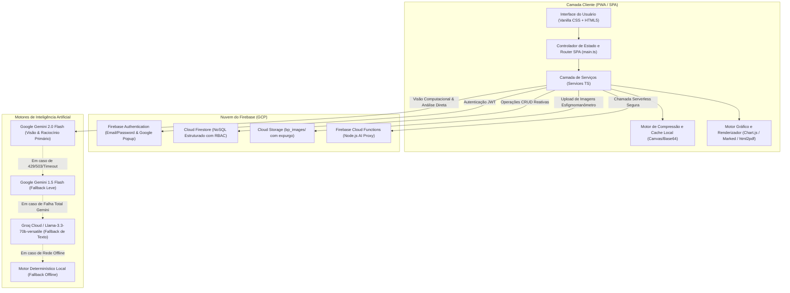

# 🏗️ Especificação 01: Arquitetura e Visão Geral do Sistema KardIA

> **Documento:** Caderno de Arquitetura de Software e Infraestrutura  
> **Sistema:** KardIA — Assistente de Saúde Preventiva  
> **Versão:** 2.0.0  
> **Classificação:** Documento Técnico Oficial  

---

## 1. Visão Geral da Arquitetura

O **KardIA** adota uma arquitetura **Serverless Jamstack & Single-Page Application (SPA)** de alto desempenho, orientada a eventos e baseada em microsserviços gerenciados na nuvem (Google Cloud / Firebase). O design técnico prioriza tempo de carregamento ultrarrápido, isolamento absoluto de dados sensíveis de saúde, resiliência contra indisponibilidades de APIs de Inteligência Artificial e compatibilidade universal entre dispositivos móveis e navegadores desktop.



---

## 2. Stack Tecnológica Detalhada

### 2.1. Frontend & Core
- **Linguagem:** TypeScript (v5.x), garantindo tipagem estrita para todos os biomarcadores, leituras e contratos de API.
- **Empacotador e Servidor de Desenvolvimento:** Vite (v5.x), proporcionando compilação estática instantânea (HMR) e otimização de bundle com tree-shaking agressivo.
- **Estrutura e Marcação:** HTML5 Semântico com suporte integral a Progressive Web App (PWA) via `manifest.json` e Service Worker (`sw.js`).
- **Camada de Estilização:** Vanilla CSS 3 Moderno, sem frameworks pesados ou classes ad-hoc não padronizadas, utilizando um Design System baseado em variáveis CSS (CSS Tokens), Glassmorphism refinado, sombras suaves e paleta voltada ao acolhimento psicológico de pacientes em monitoramento de saúde.

### 2.2. Visualização de Dados, Documentos e IA no Cliente
- **Renderização Gráfica:** `Chart.js` (com registro modular via `registerables`), suportando gráficos dinâmicos de tendência cardiovascular, evolução glicêmica com limites de corte e histórico hídrico semanal.
- **Processamento de Markdown e Sanitização:** `marked` para renderização dos pareceres clínicos da IA combinado com `DOMPurify` para sanitização contra ataques Cross-Site Scripting (XSS).
- **Emissão de Laudos em PDF:** `html2pdf.js`, gerando documentos clínicos padronizados diretamente no navegador do paciente, em formato A4, com cabeçalho institucional, dados do paciente e assinatura eletrônica automatizada.

### 2.3. Backend Serverless & Banco de Dados
- **Identidade e Autenticação:** Firebase Authentication com suporte a credenciais de e-mail/senha e login federado via Google OAuth 2.0.
- **Banco de Dados NoSQL:** Cloud Firestore com sincronização em tempo real, suporte a queries offline e controle estrito de permissões baseado em regras de segurança (`firestore.rules`).
- **Armazenamento de Arquivos:** Cloud Storage for Firebase para custódia temporária e criptografada de imagens de medidores digitais.
- **Computação Serverless:** Firebase Cloud Functions (Node.js 18+) para orquestração isolada de chamadas à API da Google Generative AI e proteção de segredos de ambiente.

### 2.4. Motores de Inteligência Artificial
- **Primário Multimodal:** Google Gemini 2.0 Flash (`gemini-2.0-flash`), especializado em extração rápida de OCR e análise correlacionada de dados clínicos.
- **Secundário Multimodal:** Google Gemini 1.5 Flash (`gemini-1.5-flash`), com baixa latência e alta tolerância a picos de tráfego.
- **Terceiro Nível (Texto puro):** Groq Cloud API executando o modelo de alta performance `llama-3.3-70b-versatile`, acionado em caso de indisponibilidade ou esgotamento de cota da API Google.
- **Quarto Nível (Offline / Determinístico):** Módulo interno em TypeScript que aplica árvores de decisão baseadas nos parâmetros da OMS e SBC diretamente na memória do navegador.

---

## 3. Topologia e Estrutura do Repositório

```
pressao/
├── docs/                                # Base de Especificações Técnicas (SDD)
│   ├── README.md                        # Índice Mestre da Documentação
│   ├── 01-arquitetura-e-visao-geral.md  # Arquitetura e Engenharia do Sistema
│   ├── 02-autenticacao-e-perfil-de-usuario.md
│   ├── 03-monitoramento-cardiovascular.md
│   ├── 04-visao-computacional-ocr.md
│   ├── 05-controle-glicemico-e-diabetes.md
│   ├── 06-gestao-de-hidratacao.md
│   ├── 07-gestao-farmacologica.md
│   ├── 08-antropometria-e-historico-de-peso.md
│   ├── 09-motor-de-inteligencia-artificial.md
│   ├── 10-exportacao-e-laudos-medicos.md
│   ├── 11-painel-administrativo-super-user.md
│   ├── 12-banco-de-dados-seguranca-e-regras.md
│   └── 13-design-system-ui-ux.md
├── pressao-app/                         # Aplicação Web & SPA
│   ├── functions/                       # Cloud Functions Serverless
│   │   ├── index.js                     # Endpoint HTTPS de análise Gemini
│   │   └── package.json                 # Dependências Node.js serverless
│   ├── public/                          # Recursos estáticos PWA
│   │   ├── favicon.ico
│   │   ├── icon-192.png
│   │   ├── icon-512.png
│   │   └── manifest.json                # Manifesto PWA
│   ├── src/                             # Código-fonte da aplicação
│   │   ├── assets/                      # Imagens, vetores e ícones
│   │   ├── services/                    # Camada de Serviços e Negócio
│   │   │   ├── afericoes.ts             # Regras de Pressão Arterial e Laudo OMS
│   │   │   ├── agua.ts                  # Gestão de Hidratação
│   │   │   ├── ai-config.ts             # Orquestrador de IA e Fallbacks
│   │   │   ├── analise-diaria.ts        # Resumos diários unificados
│   │   │   ├── auth.ts                  # Autenticação, RBAC e Perfil
│   │   │   ├── glicemia.ts              # Regras de Glicemia e Diabetes
│   │   │   ├── medications.ts           # Gestão Farmacológica
│   │   │   ├── ocr.ts                   # Visão Computacional Gemini
│   │   │   └── utils.ts                 # Utilitários de parsing e datas
│   │   ├── utils/
│   │   │   └── dicas.ts                 # Dicas preventivas contextuais
│   │   ├── firebase.ts                  # Inicialização SDK Firebase
│   │   ├── main.ts                      # Controlador Geral da SPA
│   │   ├── style.css                    # Design System Vanilla CSS
│   │   └── types.ts                     # Interfaces e Contratos TypeScript
│   ├── cors.json                        # Configuração CORS do Cloud Storage
│   ├── firebase.json                    # Configuração de Deploy e Hosting Firebase
│   ├── firestore.indexes.json           # Índices Compostos do Firestore
│   ├── firestore.rules                  # Regras de Segurança e Isolamento RBAC
│   ├── index.html                       # Documento SPA e Telas da Aplicação
│   ├── package.json                     # Dependências do Cliente
│   ├── storage.rules                    # Regras de Segurança do Cloud Storage
│   └── tsconfig.json                    # Configuração do Compilador TypeScript
├── set_admin_claim.js                   # Utilitário CLI para elevação de Super Admin
├── README.md                            # Apresentação do Repositório Open Source
└── LICENSE                              # Licença MIT com Medical Disclaimer
```

---

## 4. Filosofia de Desenvolvimento e Princípios Não-Negociáveis

1. **Spec-Driven Development (SDD):** Nenhuma alteração de código ou funcionalidade médica é implementada sem especificação prévia de requisitos, fórmulas clínicas, guardrails de segurança e cenários de erro.
2. **Privacy by Design & LGPD:** Dados de saúde pertencem exclusivamente ao paciente. Não há cookies de rastreamento comercial, telemetria invasiva ou cruzamento de dados com terceiros.
3. **Resiliência e Tolerância a Falhas:** Toda requisição à nuvem ou a serviços de IA possui um circuito de fallback (Degradação Graciosa). O paciente nunca fica sem resposta na tela em momentos de crise de saúde.
4. **Isolamento de Papéis (RBAC com Custom Claims):** A separação entre usuários comuns (`USER`) e administradores (`ADMIN`) é validada na camada de infraestrutura via JWT assinado criptograficamente pelo Firebase, impedindo qualquer acesso indevido ou bypass via client-side.
