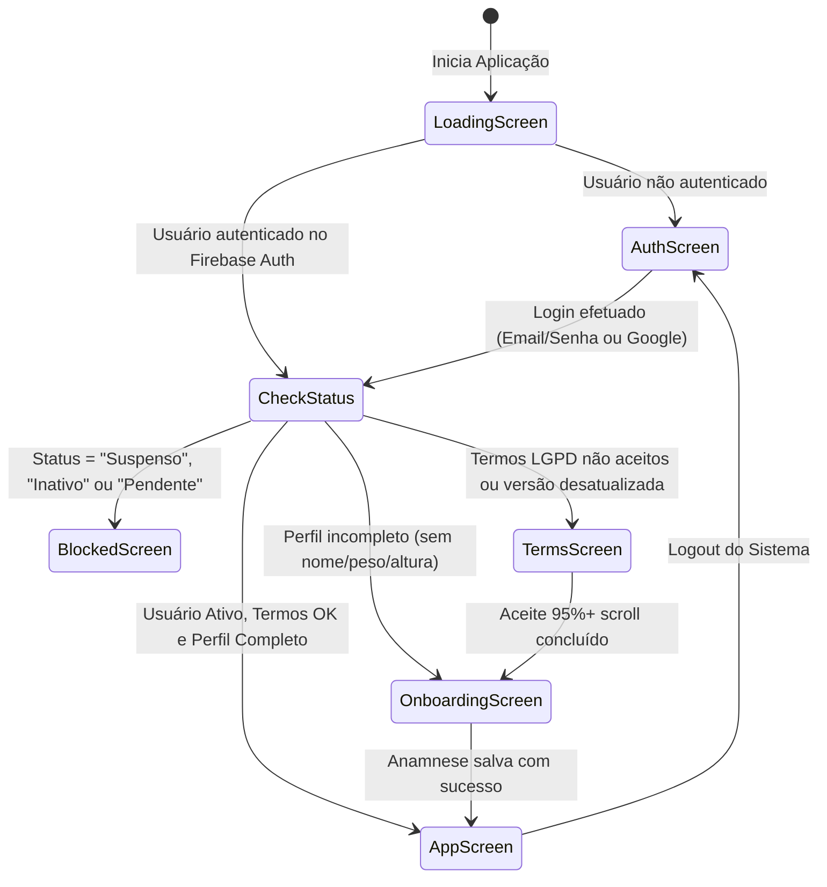

# 🔐 Especificação 02: Autenticação, RBAC e Gestão de Perfil de Usuário

> **Documento:** Caderno de Especificação de Identidade, Acesso e Perfil do Paciente  
> **Sistema:** KardIA — Assistente de Saúde Preventiva  
> **Versão:** 2.0.0  
> **Classificação:** Documento Técnico Oficial  

---

## 1. Visão Geral do Módulo

O módulo de identidade do KardIA gerencia o ciclo de vida completo do usuário no ecossistema, desde o primeiro acesso até o consentimento explícito sob a Lei Geral de Proteção de Dados (LGPD - Lei nº 13.709/2018), preenchimento da anamnese clínica de entrada, governança de papéis (Role-Based Access Control - RBAC) e controle de status de conta (Ativo, Pendente, Suspenso ou Inativo).

---

## 2. Máquina de Estados de Navegação e Telas

O fluxo de entrada do sistema é regido por uma máquina de estados estrita implementada na função `mostrarTela(id: string)` em [`main.ts`](file:///c:/Users/wagner.msilva/Desktop/PROJETOS/pressao/pressao-app/src/main.ts#L64-L73):



### 2.1. Descrição dos Estados de Tela

1. **`loading-screen`:** Exibida imediatamente ao carregar a SPA enquanto o observer `observarAutenticacao` (`onAuthStateChanged`) resolve o token JWT do Firebase Auth e busca o documento correspondente na coleção `/users/{uid}` do Firestore.
2. **`auth-screen`:** Apresenta a interface de boas-vindas dividida em duas colunas:
   - **Coluna Esquerda (Marketing & Copywriting de Conversão):** Imagem contextual de vida ativa e saudável com mensagem de valor terapêutico.
   - **Coluna Direita (Formulário de Acesso):** Abas para alternância instantânea entre "Entrar" e "Cadastrar", campos com botão de visibilidade de senha (olho SVG) e botão de login único via Google OAuth.
3. **`terms-screen`:** Bloqueio mandatório de conformidade legal. Exibe os Termos de Uso e a Política de Privacidade com mecanismo antifraude de leitura obrigatória.
4. **`onboarding-screen`:** Formulário de acolhimento e anamnese inicial onde o paciente registra seus dados biométricos e histórico clínico.
5. **`blocked-screen`:** Exibida quando a conta do usuário foi colocada em estado de pendência administrativa, suspensão ou inativação pelo Super Admin.
6. **`app-screen`:** Dashboard e interface operacional completa do paciente/administrador.

---

## 3. Mecanismos de Autenticação

### 3.1. Autenticação por E-mail e Senha
- **Cadastro (`registrarUsuario`):** Requer e-mail válido e senha com comprimento mínimo de 6 caracteres (validação client-side e enforcement pelo Firebase Auth). Ao criar a conta no Firebase Auth, o perfil inicial é gerado no Firestore com status padrão `Ativo`, plano `Gratuito` e role `USER`.
- **Login (`loginUsuario`):** Autentica com `signInWithEmailAndPassword`. Mensagens de erro de credenciais inválidas são mapeadas e exibidas em português sem expor se o e-mail existe ou não no banco (proteção contra enumeração de usuários).

### 3.2. Autenticação via Google OAuth 2.0 (`loginComGoogle`)
- **Decisão Arquitetural:** O KardIA utiliza exclusivamente `signInWithPopup` em substituição a `signInWithRedirect`.
- **Justificativa Técnica:** Navegadores modernos (Safari iOS, Chrome com Proteção Contra Rastreamento e Firefox) bloqueiam cookies de terceiros em redirecionamentos entre domínios cruzados (ex.: domínio de produção na Vercel/Hosting vs. `*.firebaseapp.com`), causando perda de estado de sessão e loops infinitos no redirect. O fluxo com Popup isola o handshake de autorização em janela controlada com o parâmetro `prompt: 'select_account'`.

---

## 4. Governança Legal LGPD: Mecanismo de Scroll Mandatório

Em conformidade rigorosa com o Artigo 7º e Artigo 8º da LGPD (Consentimento Livre, Informado e Inequívoco para Dados Sensíveis de Saúde), o KardIA implementa um mecanismo de trava de rolagem que impede o aceite automatizado ou por impulso:

```typescript
// Localização: pressao-app/src/main.ts
function inicializarScrollTermos() {
  const scrollBox = document.getElementById('terms-scroll-box');
  const progressFill = document.getElementById('terms-progress-fill');
  const progressLabel = document.getElementById('terms-progress-label');
  const checkbox = document.getElementById('terms-checkbox') as HTMLInputElement;
  const acceptBtn = document.getElementById('btn-aceitar-termos') as HTMLButtonElement;

  // Estado inicial travado
  checkbox.checked = false;
  checkbox.disabled = true;
  acceptBtn.disabled = true;

  const handleScroll = () => {
    const { scrollTop, scrollHeight, clientHeight } = scrollBox;
    const scrollable = scrollHeight - clientHeight;
    if (scrollable <= 0) return;

    const pct = Math.min(100, Math.round((scrollTop / scrollable) * 100));
    let displayPct = (scrollTop + clientHeight >= scrollHeight - 5) ? 100 : pct;

    progressFill.style.width = displayPct + '%';
    progressLabel.textContent = displayPct + '% lido';

    // Habilita a caixa de seleção somente a partir de 95% de rolagem comprovada
    if (displayPct >= 95) {
      checkbox.disabled = false;
    }
  };

  scrollBox.addEventListener('scroll', handleScroll);
}
```

### 4.1. Auditoria do Aceite
Ao confirmar a leitura, a função `aceitarTermos(uid)` registra no Firestore:
- `termos_aceitos: true`
- `termos_aceitos_em: "2026-08-21T18:00:00.000Z"` (ISO String UTC)
- `termos_versao: "1.0"` (constante `TERMOS_VERSAO_ATUAL`)

---

## 5. Anamnese Clínica e Modelo de Dados do Perfil

O modelo de dados `UserProfile` define todos os atributos biométricos, históricos e administrativos do paciente:

```typescript
// Localização: pressao-app/src/types.ts
export interface UserProfile {
  uid: string;
  email?: string;
  nome: string;
  sexo: 'masculino' | 'feminino' | 'outro';
  idade: number;
  peso: number;           // Peso atual em quilogramas (kg)
  altura?: number;        // Estatura em centímetros (cm)
  nascimento?: string;    // Data no formato YYYY-MM-DD
  data_criacao: Date;     // Timestamp de cadastro no sistema
  
  // Níveis de Acesso e Governança
  role?: 'ADMIN' | 'USER';
  plano?: 'Gratuito' | 'Premium' | 'Ouro';
  status?: 'Pendente' | 'Ativo' | 'Suspenso' | 'Inativo';
  
  // Anamnese e Comorbidades de Saúde
  hipertenso?: boolean;   // Diagnóstico prévio de Hipertensão Arterial Sistêmica (HAS)
  diabetico?: boolean;    // Diagnóstico de Diabetes Mellitus (DM tipo 1 ou 2)
  fumante?: boolean;      // Hábito tabágico ativo
  sedentario?: boolean;   // Ausência de atividade física regular
  usaMedicacao?: boolean; // Uso contínuo de fármacos para controle de pressão/metabolismo
  
  // Governança LGPD
  termos_aceitos?: boolean;
  termos_aceitos_em?: string;
  termos_versao?: string;
}
```

---

## 6. Histórico de Peso Temporal (`weight_history`)

Além do peso estático no perfil, o KardIA mantém uma coleção independente `/weight_history` para acompanhar a evolução ponderal e correlacioná-la com as curvas de pressão e glicemia ao longo do tempo:

```typescript
// Localização: pressao-app/src/services/auth.ts
export const salvarHistoricoPeso = async (
  uid: string,
  peso: number,
  data: Date = new Date(),
  id?: string
): Promise<void> => {
  const docRef = id ? doc(db, 'weight_history', id) : doc(collection(db, 'weight_history'));
  await setDoc(docRef, {
    user_id: uid,
    peso: Number(peso),
    data: Timestamp.fromDate(data)
  }, { merge: true });
};
```

Quando um novo peso é registrado:
1. O registro é adicionado a `/weight_history`.
2. O campo `peso` no documento `/users/{uid}` é sincronizado.
3. O valor do IMC é recalculado em tempo real na interface.
4. A meta diária de consumo de água ($35\text{ mL/kg}$) é atualizada automaticamente no módulo de hidratação.
