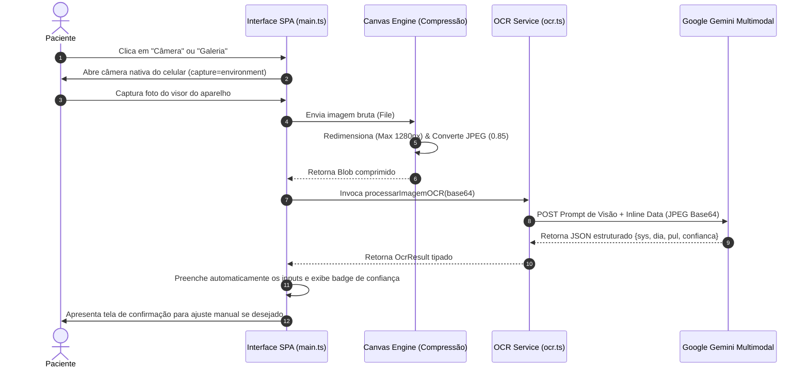

# 📸 Especificação 04: Visão Computacional e Leitura Automática (OCR)

> **Documento:** Caderno de Especificação do Pipeline Multimodal de OCR  
> **Sistema:** KardIA — Assistente de Saúde Preventiva  
> **Versão:** 2.0.0  
> **Classificação:** Documento Técnico Oficial  

---

## 1. Visão Geral do Módulo

O módulo de **Visão Computacional & OCR** do KardIA elimina a necessidade de digitação manual de medições por parte de pacientes idosos ou em momentos de crise. Ao apontar a câmera do smartphone ou selecionar uma foto do visor LCD/LED do esfigmomanômetro digital (ou glicosímetro), a inteligência artificial multimodal extrai os valores de pressão sistólica, diastólica, pulso e data/hora, validando os números com critérios clínicos de consistência.



---

## 2. Pipeline de Captura e Pré-Processamento no Cliente

### 2.1. Captura de Imagem Direta
No arquivo [`index.html`](file:///c:/Users/wagner.msilva/Desktop/PROJETOS/pressao/pressao-app/index.html#L1634-L1658), o modal de nova aferição oferece duas opções de entrada:
- **Câmera Traseira:** `file-input.setAttribute('capture', 'environment')`, acionando a câmera fotográfica nativa do dispositivo sem necessidade de permissões complexas de stream de vídeo.
- **Galeria de Fotos:** `file-input.removeAttribute('capture')`, permitindo carregar imagens armazenadas.

### 2.2. Otimização e Compressão no Navegador (`comprimirImagem`)
Imagens brutas de smartphones modernos possuem entre 5MB e 15MB ($4000\times3000\text{ pixels}$), o que aumentaria desnecessariamente o tempo de upload e o custo de processamento de tokens. O KardIA executa uma rotina de compressão no cliente via HTML5 Canvas:

```typescript
// Localização: pressao-app/src/services/ocr.ts
export const comprimirImagem = (arquivo: File, qualidade: number = 0.85): Promise<File> => {
  return new Promise((resolve) => {
    const canvas = document.createElement('canvas');
    const ctx = canvas.getContext('2d')!;
    const img = new Image();

    img.onload = () => {
      const maxW = 1280; // Largura máxima otimizada para visores LCD
      const ratio = Math.min(maxW / img.width, maxW / img.height, 1);
      canvas.width = img.width * ratio;
      canvas.height = img.height * ratio;

      ctx.drawImage(img, 0, 0, canvas.width, canvas.height);

      canvas.toBlob(
        (blob) => {
          if (blob) {
            resolve(new File([blob], arquivo.name, { type: 'image/jpeg' }));
          } else {
            resolve(arquivo);
          }
        },
        'image/jpeg',
        qualidade
      );
    };

    img.onerror = () => resolve(arquivo);
    img.src = URL.createObjectURL(arquivo);
  });
};
```

---

## 3. Engenharia do Prompt de Visão Computacional

O prompt do OCR foi elaborado para filtrar artefatos visuais típicos de visores de cristal líquido reflexivos (LCD de 7 segmentos):

```text
Analise esta imagem de um medidor de pressão arterial digital (esfigmomanômetro).

REGRAS IMPORTANTES:
- Ignore reflexos, brilhos, sombras e artefatos visuais.
- Foque APENAS nos números mostrados no visor LCD/LED.
- SYS (sistólica): o número maior, normalmente no topo ou à esquerda. Geralmente entre 90 e 200.
- DIA (diastólica): o número menor. Geralmente entre 50 e 130.
- PUL (pulso/BPM): frequência cardíaca. Geralmente entre 40 e 180.
- Se o medidor mostrar um símbolo de batimento irregular (arritmia), ignore-o para os valores numéricos.
- Não confunda o símbolo "AVG" ou "M" (memória) com um número.

Retorne SOMENTE um JSON válido (sem markdown, sem texto extra) com esta estrutura exata:
{
  "sys": número ou null,
  "dia": número ou null,
  "pul": número ou null,
  "data_hora": "string ISO ou null (apenas se o aparelho mostrar data/hora)",
  "confianca": "alta" | "media" | "baixa"
}

Critérios de confiança:
- "alta": imagem nítida, todos os 3 valores claramente visíveis e plausíveis
- "media": imagem com alguma distorção ou 1 valor duvidoso
- "baixa": imagem muito borrada, reflexo intenso ou valores implausíveis
```

---

## 4. Contrato de Retorno do OCR (`OcrResult`)

```typescript
// Localização: pressao-app/src/services/ocr.ts
export interface OcrResult {
  sys?: number;                 // Pressão Sistólica identificada
  dia?: number;                 // Pressão Diastólica identificada
  pul?: number;                 // Pulso/BPM identificado
  data_hora?: Date;             // Data/hora registrada na tela do aparelho (se visível)
  confianca: 'alta' | 'media' | 'baixa'; // Índice de assertividade
  texto_bruto?: string;         // Retorno bruto do modelo para depuração
  modelo_usado?: string;        // Identificador do modelo de IA utilizado
}
```

---

## 5. Estratégia de Fallback em Cascata para Visão

O pipeline de OCR utiliza a lista prioritária `OCR_MODELS`:
1. **`gemini-2.0-flash` (Primário):** Alta velocidade, processamento multimodal nativo e excelente resolução de caracteres segmentados de 7 dígitos.
2. **`gemini-1.5-flash` (Secundário):** Modelo de fallback caso o primário retorne erro de cota (429) ou indisponibilidade de serviço (503).
3. **Fallback para Entrada Manual (`pularOCR`):** Caso a câmera falhe ou a foto esteja irreconhecível (`confianca: 'baixa'`), o usuário clica em "Inserir manualmente" e é direcionado diretamente aos campos numéricos.
