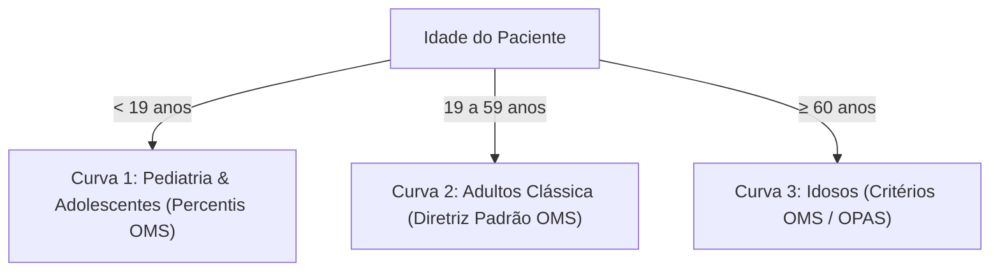

# ⚖️ Especificação 08: Antropometria, Estratificação de IMC e Evolução Ponderal

> **Documento:** Caderno de Especificação Técnica e Clínica do Módulo Antropométrico  
> **Sistema:** KardIA — Assistente de Saúde Preventiva  
> **Versão:** 2.0.0  
> **Classificação:** Documento Técnico Oficial  

---

## 1. Visão Geral do Módulo

O módulo antropométrico é responsável pelo cálculo e classificação do **Índice de Massa Corporal (IMC)**, rastreamento temporal da variação de peso e correlação das alterações corporais com o risco de Hipertensão Arterial Sistêmica e Diabetes Mellitus. 

O KardIA se diferencia por **não utilizar uma regra simplista única de adultos para toda a população**: o sistema aplica **3 curvas clínicas estratificadas por faixa etária** recomendadas pela OMS e pela OPAS.

---

## 2. Fórmula Base do Índice de Massa Corporal

$$\text{IMC} = \frac{\text{Peso (kg)}}{(\text{Altura (m)})^2} = \frac{\text{Peso (kg)}}{\left(\frac{\text{Altura (cm)}}{100}\right)^2}$$

---

## 3. As 3 Curvas de Classificação Clínica do KardIA

A função `classificarImc` implementada em [`types.ts`](file:///c:/Users/wagner.msilva/Desktop/PROJETOS/pressao/pressao-app/src/types.ts#L260-L390) avalia a idade e a estatura para selecionar a diretriz adequada:



---

### 3.1. Curva 1: Crianças e Adolescentes ($< 19\text{ anos}$) — Percentis OMS
Em jovens em fase de crescimento, a composição óssea e muscular varia anualmente. O KardIA adota as faixas correspondentes aos percentis da OMS:

| Faixa de IMC | Classificação Clínica | Percentil OMS | Cor Semântica |
| :--- | :--- | :--- | :--- |
| $\text{IMC} < 14.0$ | **Desnutrição / Baixo Peso** | $<$ Percentil 3 | `#1565C0` (Azul) |
| $14.0 \le \text{IMC} < 21.0$ | **Peso Adequado (Eutrofia)** | Percentil 3 a 85 | `#2E7D32` (Verde) |
| $21.0 \le \text{IMC} < 25.0$ | **Sobrepeso / Risco** | Percentil 85 a 97 | `#F57C00` (Amarelo) |
| $\text{IMC} \ge 25.0$ | **Obesidade Juvenil** | $>$ Percentil 97 | `#C62828` (Vermelho) |

---

### 3.2. Curva 2: Adultos ($19 \text{ a } 59\text{ anos}$) — Diretriz Clássica OMS

| Faixa de IMC ($\text{kg/m}^2$) | Classificação Clínica | Risco Cardiovascular Associado | Cor Semântica |
| :--- | :--- | :--- | :--- |
| $< 18.5$ | **Baixo Peso** | Risco aumentado de desnutrição e imunossupressão | `#1565C0` (Azul) |
| $18.5 \text{ a } 24.9$ | **Peso Saudável (Eutrofia)** | Risco cardiovascular e metabólico basal/mínimo | `#2E7D32` (Verde) |
| $25.0 \text{ a } 29.9$ | **Sobrepeso** | Risco cardiovascular moderadamente aumentado | `#F57C00` (Amarelo) |
| $30.0 \text{ a } 34.9$ | **Obesidade Grau I** | Risco elevado de HAS, DM2 e dislipidemia | `#E53935` (Laranja) |
| $35.0 \text{ a } 39.9$ | **Obesidade Grau II** | Risco muito alto de eventos isquêmicos e infarto | `#C62828` (Vermelho) |
| $\ge 40.0$ | **Obesidade Grau III (Grave)** | Risco crítico; acompanhamento multiprofissional urgente | `#7B0D1E` (Bordô) |

---

### 3.3. Curva 3: Idosos ($\ge 60\text{ anos}$) — Critérios OMS / OPAS
Idosos apresentam sarcopenia natural (perda de massa muscular) e redistribuição de gordura corporal. Segundo a Organização Pan-Americana da Saúde (OPAS), um IMC ligeiramente mais alto confere reserva nutricional protetora:

| Faixa de IMC ($\text{kg/m}^2$) | Classificação Clínica (Idosos) | Conduta Preventiva | Cor Semântica |
| :--- | :--- | :--- | :--- |
| $\text{IMC} \le 22.0$ | **Baixo Peso (Idoso)** | Atenção nutricional preventiva contra fragilidade. | `#1565C0` (Azul) |
| $22.0 < \text{IMC} < 27.0$ | **Peso Adequado (Eutrofia)** | Faixa ideal de longevidade e proteção do idoso. | `#2E7D32` (Verde) |
| $\text{IMC} \ge 27.0$ | **Sobrepeso / Obesidade** | Vigilância sobre mobilidade articular e sobrecarga cardíaca. | `#C62828` (Vermelho) |

---

## 4. Histórico de Pesagens (`weight_history`)

```typescript
// Localização: pressao-app/src/services/auth.ts
export interface WeightHistoryEntry {
  id: string;
  peso: number;
  data: Date;
}
```

### 4.1. Visualização em `Chart.js` (`weight-chart`)
- Renderiza a curva evolutiva das pesagens com interpolação suave (`tension: 0.2`).
- Eixo Y calibrado com margem de $\pm 3\text{ kg}$ em relação aos extremos registrados.
- Lista cronológica reversa com opção de exclusão individual (`excluirPeso(id)`).

---

## 5. Migração de Usuários Legados (`imc-legacy-card`)

Para garantir retrocompatibilidade com usuários cadastrados antes da versão 2.0 (que não possuíam altura informada):
1. O sistema verifica `if (!userProfile.altura || userProfile.altura <= 0)`.
2. Exibe o card de destaque `imc-legacy-card` convidando o usuário a salvar sua altura em centímetros.
3. Ao submeter com `salvarAlturaLegada()`, o Firestore é atualizado com `updateDoc` e a aba de IMC é desbloqueada instantaneamente.
