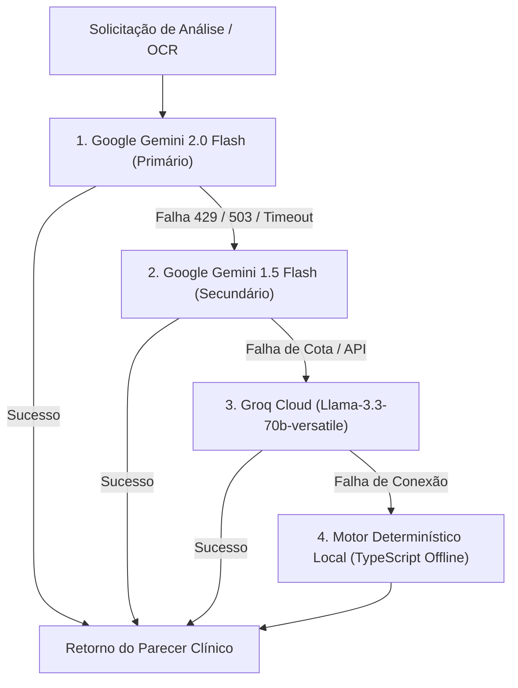

# 🤖 Especificação 09: Motor de Inteligência Artificial e Engenharia de Prompts

> **Documento:** Caderno de Especificação de Inteligência Artificial Generativa e Raciocínio Clínico  
> **Sistema:** KardIA — Assistente de Saúde Preventiva  
> **Versão:** 2.0.0  
> **Classificação:** Documento Técnico Oficial  

---

## 1. Visão Geral da Arquitetura de IA

O motor de Inteligência Artificial do KardIA foi concebido para atuar como um **interlocutor de suporte à decisão clínica preventiva**, correlacionando variáveis heterogêneas (hemodinâmica, metabolismo, antropometria, farmacologia e hidratação) e gerando pareceres humanizados, claros e estritamente aderentes aos consensos médicos da **OMS**, **SBC** e **SBD**.

---

## 2. Estratégia de Fallback em Cascata Quádrupla (`comFallback`)

Para assegurar disponibilidade ininterrupta mesmo durante instabilidades globais de provedores de IA, o arquivo [`ai-config.ts`](file:///c:/Users/wagner.msilva/Desktop/PROJETOS/pressao/pressao-app/src/services/ai-config.ts) implementa um circuito de contingência com 4 camadas:



### 2.1. Implementação do Circuito em TypeScript

```typescript
// Localização: pressao-app/src/services/ai-config.ts
export async function comFallback<T>(
  modelos: string[],
  executor: (modelName: string) => Promise<T>,
  prompt?: string
): Promise<T> {
  let ultimoErro: Error | null = null;

  // 1 e 2: Tenta a cascata de modelos Google Gemini
  for (const modelName of modelos) {
    try {
      const resultado = await executor(modelName);
      return resultado;
    } catch (err: any) {
      ultimoErro = err;
      console.warn(`[IA] Modelo ${modelName} falhou. Tentando próximo...`);
    }
  }

  // 3: Tenta fallback de alta velocidade com Groq Cloud (Llama-3.3-70b)
  if (prompt) {
    try {
      const text = await chamarGroqFallback(prompt);
      return { text, modelName: 'groq/llama-3.3-70b-versatile' } as unknown as T;
    } catch (groqErr: any) {
      ultimoErro = groqErr;
    }
  }

  throw ultimoErro || new Error('[IA] Todos os modelos falharam.');
}
```

---

## 3. Catálogo de Prompts Clínicos Especializados

### 3.1. Análise Individual de Pressão Arterial (`montarPromptAnalise`)
- **Objetivo:** Analisar uma aferição recém-cadastrada no contexto dos dados do paciente e seu histórico recente.
- **Injeção de Variáveis:**
  - Idade, Sexo, Peso Histórico e Altura.
  - IMC calculado e respectiva faixa da OMS.
  - Comorbidades declaradas (Hipertenso, Diabético, Fumante, Sedentário).
  - Medicações ativas em uso.
  - Consumo de água do dia versus meta calculada.
  - Histórico cronológico das últimas 20 aferições.
- **Guardrails de Formatação:**
  - Proibição estrita dos caracteres `<` e `>` para evitar quebras em parsers HTML/XML.
  - Tamanho controlado entre 3 e 5 frases acolhedoras e completas.

### 3.2. Análise Individual de Glicemia (`montarPromptGlicemia`)
- **Objetivo:** Emitir recomendação imediata após medição de glicemia capilar.
- **Guardrails Específicos:**
  - Proibição de negritos ou asteriscos para simplificar leitura em notificações móveis.
  - Protocolo de segurança em caso de hipoglicemia ($< 70\text{ mg/dL}$).
  - Ponderação circadiana sobre a hidratação matinal.

### 3.3. Relatório de Conduta Clínica Integrada (`gerarRelatorioCondutaOMS`)
- **Objetivo:** Gerar um parecer multidimensional completo sobre os últimos 7, 14 ou 30 dias para apresentação em consultas médicas.
- **Estrutura do Parecer:**
  1. **Resumo do Quadro Geral de Saúde:** Médias, picos e variabilidade de pressão arterial e glicemia.
  2. **Análise de Fatores Cruzados:** Relação entre hidratação, peso/IMC e estabilidade cardiovascular.
  3. **Conduta Alimentar e de Estilo de Vida:** Orientações práticas sobre sódio, carboidratos, atividade física e ingestão hídrica.
  4. **Conduta Médica Sugerida (OMS/SBC/SBD):** Classificação do risco geral e nível de urgência recomendado.

### 3.4. Resumo Diário Unificado (`gerarAnaliseDiariaIA`)
- **Objetivo:** Consolidar todos os registros de um mesmo dia (pressão, glicemia, hidratação e peso) em um resumo conciso.
- **Regra de Estilo:** Sem uso de emojis, mantendo sobriedade técnica e concisão (máximo 2 parágrafos).

---

## 4. Sistema de Dicas Proativas Contextuais (`dicas.ts`)

A interface do KardIA exibe cards rotativos de dicas inteligentes baseados no estado de saúde do usuário:

```typescript
// Localização: pressao-app/src/utils/dicas.ts
export interface ContextoSaude {
  userProfile: UserProfile | null;
  ultimaPressao: BpReading | null;
  ultimaGlicemia: GlicemiaReading | null;
  aguaHoje: number;
  metaAgua: number;
  historicoAgua7d?: DailyWaterLog[];
}
```

1. **Dicas de Pressão (`obterDicaPressao`):**
   - Se última pressão for crise/hipertensão $\rightarrow$ Emite alerta de repouso imediato e redução de sódio.
   - Se fizer uso de medicação $\rightarrow$ Lembra da importância da regularidade no horário das doses.
   - Estado normal $\rightarrow$ Orientações sobre sono, técnica da tripla medição e alimentos ricos em potássio.
2. **Dicas de Glicemia (`obterDicaGlicemia`):**
   - Se hiperglicemia $\rightarrow$ Recomenda revisão alimentar e aumento na ingestão de água.
   - Estado normal $\rightarrow$ Recomendações sobre consumo de fibras, sono reparador e atividade física como sensibilizador de insulina.
3. **Dicas de Hidratação (`obterDicaHidratacao`):**
   - Se mais de 4 dias na semana estiverem sem registro ou a média for $< 40\%$ da meta $\rightarrow$ Alerta crítico sobre sobrecarga renal e impacto no tônus vascular.

---

## 5. Isenção de Responsabilidade Médica e Guardrails Éticos

Todas as saídas geradas pelos motores de Inteligência Artificial do KardIA contêm avisos mandatórios:
> ⚠️ **Aviso de Suporte Clínico**: Este laudo e seus feedbacks constituem ferramentas de apoio ao monitoramento preventivo e **não substituem consultas médicas, exames laboratoriais ou diagnósticos formais**.
