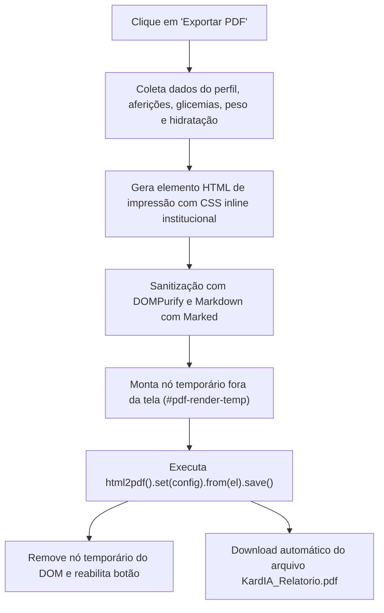

# 📄 Especificação 10: Exportação de Laudos Médicos e Relatórios em PDF

> **Documento:** Caderno de Especificação de Emissão de Documentos Clínicos e Impressão em PDF  
> **Sistema:** KardIA — Assistente de Saúde Preventiva  
> **Versão:** 2.0.0  
> **Classificação:** Documento Técnico Oficial  

---

## 1. Visão Geral do Módulo

O módulo de laudos e relatórios do KardIA tem como finalidade primordial transformar dados brutos e complexos em **documentos clínicos estruturados para apresentação em consultas médicas, triagens e prontuários hospitalares**. O módulo suporta geração de relatórios com IA, arquivamento histórico, soft-delete e exportação em formato PDF de alta fidelidade visual diretamente no navegador do paciente.

---

## 2. Modelo de Dados do Laudo Clínico (`SavedLaudo`)

```typescript
// Localização: pressao-app/src/services/afericoes.ts
export interface SavedLaudo {
  id: string;               // Identificador do documento na coleção 'laudos'
  user_id: string;          // UID do paciente
  conteudo: string;         // Texto integral do laudo formatado em Markdown
  modelo_usado?: string;    // Identificador da IA geradora (Ex: gemini-2.0-flash)
  dias_analisados?: number; // Janela temporal de análise (7, 14 ou 30 dias)
  data_geracao: Date;       // Timestamp da geração
  ativo?: boolean;          // Flag de soft-delete (true = ativo, false = inativado)
}
```

---

## 3. Requisito Clínico de Elegibilidade (Trava de 7 Dias)

Para impedir a geração de pareceres precipitados baseados em amostragens insuficientes, o KardIA exige que o paciente possua registros em pelo menos **7 dias distintos**:

```typescript
// Validação implementada no controlador da página de laudos
const diasComRegistro = new Set(afericoes.map(a => formatarData(a.data_hora_afericao))).size;

if (diasComRegistro < 7) {
  // Exibe card educativo com barra de progresso dinâmica
  document.getElementById('laudo-bloqueado-card')?.classList.remove('hidden');
  document.getElementById('laudo-progresso-bar')!.style.width = `${(diasComRegistro / 7) * 100}%`;
  document.getElementById('laudo-progresso-texto')!.textContent = `${diasComRegistro} de 7 dias com registros`;
}
```

---

## 4. Pipeline de Geração e Exportação em PDF (`html2pdf.js`)

A exportação para PDF é processada client-side com `html2pdf.js`, convertendo dinamicamente elementos HTML renderizados em documentos vetoriais prontos para impressão.



### 4.1. Configuração do Motor `html2pdf.js`

```javascript
const opt = {
  margin: [10, 10, 10, 10], // Margens de 10mm
  filename: `KardIA_Laudo_${nomeSanitizado}_${dataStr}.pdf`,
  image: { type: 'jpeg', quality: 0.98 },
  html2canvas: { scale: 2, useCORS: true, letterRendering: true },
  jsPDF: { unit: 'mm', format: 'a4', orientation: 'portrait' }
};
```

---

## 5. Modalidades de Relatórios Disponíveis

### 5.1. Laudo Clínico Integrado (Individual)
- **Estrutura Visual:**
  - Cabeçalho com logo do KardIA e dados do paciente (Nome, Idade, Sexo, IMC, Altura e Peso).
  - Tabela resumo dos marcadores biológicos e medicações ativas.
  - Parecer estruturado em tópicos (Quadro Geral, Fatores Cruzados, Conduta de Estilo de Vida e Conduta Médica).
  - Assinatura eletrônica e carimbo do motor de IA com Medical Disclaimer.

### 5.2. Relatório de Histórico Geral (Extrato Clínico)
- **Filtros Personalizáveis:**
  - Janela de datas personalizada (Data Inicial e Data Final).
- **Tipos de Visualização:**
  1. **Detalhado:** Tabela cronológica completa contendo todas as medições de pressão arterial, leituras de glicemia com momento alimentar, registros de peso e volume de hidratação diária.
  2. **Simplificado:** Resumo executivo com as médias consolidadas de SYS/DIA/PUL, média glicêmica e taxa de conformidade hídrica.

---

## 6. Governança e Soft-Delete de Laudos (`inativarLaudo`)

Laudos médicos antigos ou descartados pelo paciente não são apagados fisicamente do banco de dados (preservando a integridade legal de histórico):
1. A função `inativarLaudo(laudoId)` executa `updateDoc(docRef, { ativo: false, data_inativacao: new Date() })`.
2. A listagem do usuário oculta laudos inativos por padrão (`buscarLaudos(uid, false)`).
3. O Super Admin possui visibilidade integral sobre laudos inativos no painel de auditoria.
