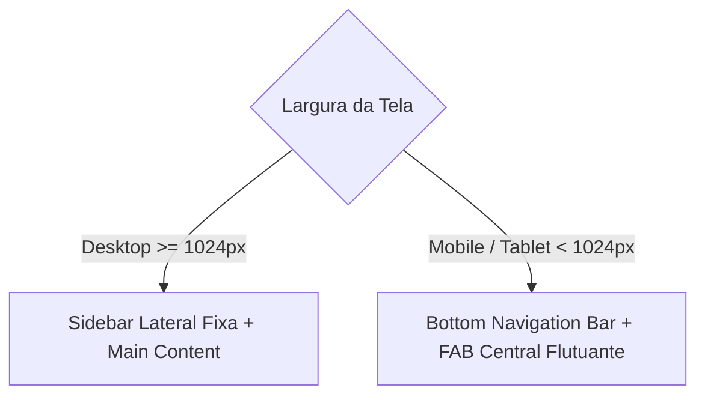

# 🎨 Especificação 13: Design System, UI/UX e Experiência do Usuário

> **Documento:** Caderno de Especificação de Design System, Tokens e Experiência Visual  
> **Sistema:** KardIA — Assistente de Saúde Preventiva  
> **Versão:** 2.0.0  
> **Classificação:** Documento Técnico Oficial  

---

## 1. Filosofia de Design e UX para Saúde Preventiva

A interface do KardIA foi concebida sob o princípio da **Psicologia das Cores Aplicada à Saúde e Redução de Ansiedade (Anti-Stress UI)**. Ao lidar com leituras de pressão arterial e glicose, o design evita estímulos visuais agressivos, fontes excessivamente contrastantes ou elementos alarmistas desnecessários, priorizando tons que transmitem segurança, acolhimento e clareza cognitiva.

---

## 2. Paleta Cromática e Tokens de Design (`style.css`)

O Design System opera com variáveis CSS nativas (Tokens), garantindo consistência em todas as páginas, componentes e estados da SPA:

```css
:root {
  /* Cores de Identidade e Primárias */
  --primary: #2563eb;          /* Azul Clínico Confiável */
  --primary-hover: #1d4ed8;    /* Azul Interativo Escuro */
  --primary-light: #3b82f6;    /* Destaque Claro */
  --accent: #8b5cf6;           /* Roxo de Transição */
  --warning: #d97706;          /* Âmbar de Alerta / Glicemia */
  --danger: #ef4444;           /* Vermelho Crítico */
  --success: #10b981;          /* Verde Sucesso / Estabilidade */

  /* Cores de Fundo e Superfícies */
  --background: #f8fafc;       /* Fundo Geral Neutro Frio */
  --bg-card: #ffffff;          /* Superfície de Cards */
  --bg-card2: #f1f5f9;         /* Superfície Secundária / Destaques */
  --border: #e2e8f0;           /* Bordas e Divisores */
  --text: #0f172a;             /* Texto Principal (Alto Contraste) */
  --text-muted: #64748b;       /* Legendas e Metadados */

  /* Cores do Gráfico Cardiovascular */
  --chart-sys: #2563eb;        /* Sistólica (Azul) */
  --chart-dia: #9333ea;        /* Diastólica (Roxo) */
  --chart-pul: #d97706;        /* Pulso (Âmbar) */

  /* Tipografia e Raios de Borda */
  --font-family: -apple-system, BlinkMacSystemFont, 'Segoe UI', Roboto, Helvetica, Arial, sans-serif;
  --radius-sm: 8px;
  --radius-md: 12px;
  --radius-lg: 16px;
  --radius-full: 9999px;
  
  /* Sombras Terapêuticas Suaves */
  --shadow-sm: 0 1px 2px 0 rgba(0, 0, 0, 0.05);
  --shadow-md: 0 4px 6px -1px rgba(0, 0, 0, 0.1), 0 2px 4px -1px rgba(0, 0, 0, 0.06);
  --shadow-lg: 0 10px 15px -3px rgba(0, 0, 0, 0.1), 0 4px 6px -2px rgba(0, 0, 0, 0.05);
}
```

---

## 3. Matriz Cromática Semântica (Diretrizes Clínicas)

| Nível Clínico | Cor Principal | Cor do Fundo / Badge | Cor do Texto |
| :--- | :--- | :--- | :--- |
| **Normal (OMS / SBD)** | `#2E7D32` (Verde Floresta) | `#E8F5E9` (Verde Menta Suave) | `#1B5E20` |
| **Elevada / Atenção** | `#F57C00` (Laranja Âmbar) | `#FFF8E1` (Amarelo Claro) | `#E65100` |
| **Hipertensão Estágio 1** | `#E53935` (Laranja Avermelhado) | `#FFEBEE` (Rosa Claro) | `#C62828` |
| **Hipertensão Estágio 2** | `#C62828` (Vermelho Rubi) | `#FFEBEE` (Rosa Claro) | `#B71C1C` |
| **Crise Hipertensiva** | `#7B0D1E` (Bordô Escuro) | `#FFD6D6` (Rubro Alerta) | `#FFFFFF` |
| **Hipotensão / Baixo Peso**| `#1565C0` (Azul Cobalto) | `#E3F2FD` (Azul Claro) | `#0D47A1` |

---

## 4. Componentes Estruturais Reutilizáveis

### 4.1. Cards de Estatística Rápida (`stat-card`)
Containers verticais calibrados para exibição limpa de valores numéricos de alta legibilidade com unidades médicas em destaque (`mmHg`, `mg/dL`, `BPM`, `mL/dia`, `kg/m²`).

### 4.2. Dicas da OMS / Saúde (`oms-tip`)
Componente com borda lateral esquerda destacada em `--primary`, ícone SVG temático e texto de orientação preventiva contextual.

### 4.3. Sistema de Notificações Toast (`mostrarToast`)
Notificações flutuantes posicionadas no canto inferior da tela (ou centralizadas em telas móveis) com ícones vetoriais SVG de sucesso, erro ou informação e tempo de desvanecimento automático de 3.200ms:

```typescript
// Localização: pressao-app/src/main.ts
export function mostrarToast(msg: string, tipo: 'success' | 'error' | 'info' = 'info') {
  const container = document.getElementById('toast-container')!;
  const toast = document.createElement('div');
  toast.className = `toast ${tipo}`;
  // Monta ícone SVG e texto com animação CSS suave
  container.appendChild(toast);
  setTimeout(() => toast.remove(), 3200);
}
```

### 4.4. Diálogos Modais Acessíveis (`modal-overlay`)
Modais centralizados com overlay escuro translúcido com efeito de desfoque (`backdrop-filter: blur(4px)`), suporte a fechamento por clique externo, tecla `Escape` ou botão de fechamento acessível com `aria-label="Fechar"`.

---

## 5. Responsividade e Adaptação de Layout

O KardIA implementa um layout adaptativo híbrido:



- **Em Dispositivos Móveis ($< 1024\text{px}$):** A navegação principal fica no rodapé (`bottom-nav`), com o botão central de ação rápida (`fab`) em formato circular destacado para inclusão de novos registros com um único toque do polegar.
- **Em Telas Desktop ($\ge 1024\text{px}$):** A barra inferior é ocultada e substituída pela barra lateral fixa (`desktop-sidebar`), com separação entre áreas de Usuário, Administração e Conta.
